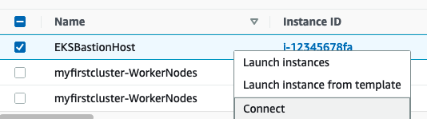
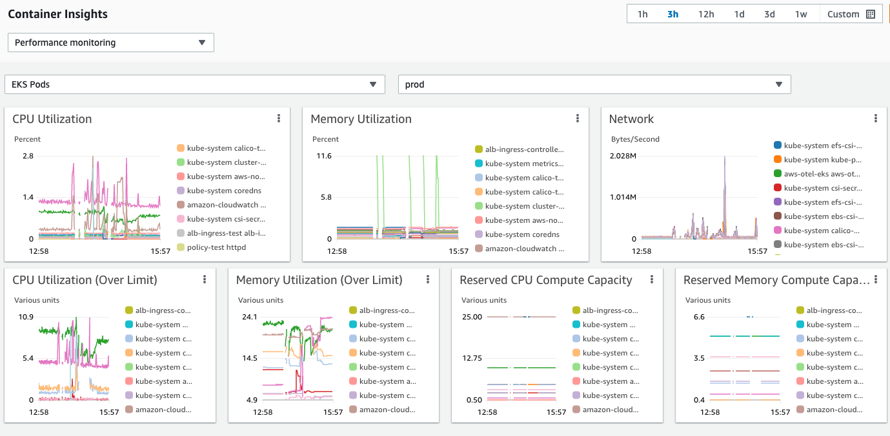
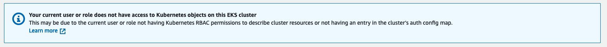

# Amazon EKS using AWS CDK with Typescript !

A sample project that deploys an EKS Cluster following a set of best practices with options to install additional addons. Easy deployment of the EBS CSI Driver, EFS CSI Driver, FluentBit Centralized Logging using Cloudwatch, Cluster Autoscaler, ALB Ingress Controller, Secrets CSI Driver and Network Policy Engine. 

## Pre-requisites

- [x] AWS CDK >= 1.115.0 check [Getting Started with AWS CDK](https://docs.aws.amazon.com/cdk/latest/guide/getting_started.html#getting_started_install) to setup your CDK environment. Run `cdk --version` to check the CLI version. 

## Usage
### Quick Start
```sh
git clone https://github.com/aws-samples/amazon-eks-using-cdk-typescript.git
# install dependant packages
npm install
# If you have not used cdk before, you may be advised to create cdk resources
CDK_NEW_BOOTSTRAP=1 cdk bootstrap aws://ACCOUNT_ID/REGION
# check the diff before deployment to understand any changes, on first run all resources will created
cdk diff
# Deploy the stack, you will be prompted for confirmation for creation of IAM and Security Group resources
cdk -c cluster_name=myfirstcluster deploy --all
# To destroy the stack
cdk destroy -c cluster_name=myfirstcluster --all
```
### Logging into Bastion Host
Go to the EC2 Console and look for an instance `Name: EKSBastionHost`. Right click on the instance and select connect


Select Session Manager and click the `Connect` button


In the new window run the following command to configure kubectl with EKS Cluster. Replace CLUSTER_NAME and REGION_NAME with the proper values. 

```sh
aws eks update-kubeconfig --name CLUSTER_NAME --region REGION_NAME
```

### Advanced Deployment
##### Default Deploy
```
cdk deploy -c cluster_name=mycluster --all
```

##### Deploy EKS Cluster Only
```
cdk deploy -c cluster_name=mycluster EKSStack 
```
##### Default Deploy with custom prefix for Cloudformation Stack 
```
cdk deploy -c cluster_name=mycluster -c stack_prefix="dev-" --all
```
_All cdk stacks will contain prefix ex. dev-EKSStack dev-EKSK8sBaseline_

##### Existing VPC 
Tag existing VPC with proper EKS Tags for ALB/NLB [auto discovery](https://kubernetes-sigs.github.io/aws-load-balancer-controller/v2.2/deploy/subnet_discovery/)
```
cdk deploy -c use_vpc_id=vpc-1234567 -c cluster_name=mycluster --all
```
_Requires VPC to have private subnets_
##### Custom Deployment
```
cdk deploy -c cluster_name=mycluster --all --parameter EKSK8sBaseline:ebsDriverParameter=true --parameter EKSK8sBaseline:albDriverParameter=false
```
_If using stack_prefix context, add prefix to parameters. ex dev-EKSK8sBaseline:ebsDriverParameter=true_
### Configuration

#### Available Parameters
 Parameters can be configured via Cloudformation [console](https://docs.aws.amazon.com/cdk/latest/guide/parameters.html#parameters_deploy) or via `cdk deploy --parameter STACK_NAME:PARAMETER_NAME=PARAMETER_VALUE`
| Stack         | Parameter            | Default       | Values        | Description   |
| ------------- | -------------        | ------------- | ------------- | ------------- |
| EKSStack      | k8sVersion  | 1.21          | [Valid Values](https://docs.aws.amazon.com/eks/latest/userguide/kubernetes-versions.html) | Kubernetes Version to deploy
| EKSStack      | eksLoggingOpts  | api,audit,authenticator,<br>controllerManager,scheduler | [Valid Logging Types](https://docs.aws.amazon.com/eks/latest/APIReference/API_LogSetup.html#API_LogSetup_Contents) | List of options to enabled, "" to disable control plane logs |
| EKSNodeGroups | nodegroupMax         | 10            | Number         | Max number of worker node to scale up for nodegroup
| EKSNodeGroups | nodegroupCount       | 2             | Number         | Desired number of worker nodes for nodegroup |
| EKSNodeGroups | nodegroupMin         | 2             | Number         | Min number of worker node to scale down for nodegroup
| EKSNodeGroups | nodegroupInstanceType| t2.medium     | String         | Instance Type to be used with EKS Managed Nodegroup ng-1
| EKSNodeGroups | nodeAMIVersion       | 1.21.2-20210722 | [Valid Values](https://docs.aws.amazon.com/eks/latest/userguide/eks-linux-ami-versions.html#eks-al2-ami-versions)         | AMI Release Version 
| EKSK8sBaseline | ebsDriver  | false         | true,false     | Deploy EBS CSI Driver |
| EKSK8sBaseline | albDriver  | true          | true,false     | Deploy ALB Ingress Controller |Driver |
| EKSK8sBaseline | efsDriver  | false         | true,false     | Deploy EFS CSI Driver |
| EKSK8sBaseline | fluentBit | true     | true,false     | Deploy FluentBit driver to output logs to centralized location
| EKSK8sBaseline | secretsDriver | false      | true,false     | Deploy AWS Secret/Parameter CSI Driver |
| EKSK8sBaseline | networkPolicyEngine | false | true,false   | Deploy Calico Network Policy Engine |
| EKSK8sBaseline | clusterAutoscaler | true     | true,false     | Deploy Cluster Autoscaler 
| EKSK8sBaseline | containerInsights | false     | true,false     | Deploy Container Insights using OpenTelemetry 
| EKSK8sBaseline | metricServer | true | true,false | Deploys Metric Server |


#### Available Context
Context can only be configured at synthesis time via  `cdk deploy -c CONTEXT_NAME=CONTEXT_VALUE` or editing cdk.json file.

| Context                        |  Default          | Values        | Description   |
| -------------                  | -------------     | ------------- | ------------- |
|eks-addon-vpc-cni-version       | v1.9.0-eksbuild.1 | AWS CLI*      | Amazon VPC Container Network Interface (CNI) plugin |
|eks-addon-kube-proxy-version    | v1.21.2-eksbuild.2| AWS CLI*      | K8s Network Proxy
|eks-addon-coredns-version       | v1.8.4-eksbuild.1 | AWS CLI*      | K8s Cluster DNS
|cluster-autoscaler-helm-version | 9.10.3            | [Values](#cluster-autoscaler) | Management of k8s worker node scaling
|aws-load-balancer-controller-helm-version| 1.2.3    | [Values](#alb-ingress-controller) | AWS Ingress Controller (ALB/NLB) | 
|aws-ebs-csi-driver-helm-version | 2.0.1             | [Values](#ebs-csi-driver) | EBS CSI Driver |
|aws-efs-csi-driver-helm-version | 2.1.4             | [Values](#efs-csi-driver) | EFS CSI Driver
|secrets-store-csi-helm-version  | 0.1.0             | [Values](#secrets-csi-driver) | Secrets CSI Driver
|aws-calico-helm-version         | 0.3.5             | [Values](#network-policy-engine) | Calico Network Policy Engine 
|cluster_name                    | myfirstcluster    | String        | Name of EKS Cluster
|use_vpc_id                      |                   | String        | (Optional) Use existing VPC to deploy resources
|stack_prefix                    |                   | String        | (Optional) Prefixes to add to underlying Cloudformation stack names 

*_Run `aws eks describe-addon-versions --kubernetes-version 1.21` to see full compatible list_
### Best Practices

Provides an example of EKS best practices in Infrastructure as Code
- [x] [Make the EKS Cluster Endpoint private](https://aws.github.io/aws-eks-best-practices/security/docs/iam/#make-the-eks-cluster-endpoint-private)
- [x] [IAM Roles for Service Accounts(IRSA) for deployable addons (ex. ALB Ingress Controller)](https://aws.github.io/aws-eks-best-practices/security/docs/iam/#kubernetes-service-accounts)
- [x] [Update the aws-node daemonset to use IRSA via EKS AddOns](https://aws.github.io/aws-eks-best-practices/security/docs/iam/#update-the-aws-node-daemonset-to-use-irsa)
- [x] [Option to enable Audit Logs](https://aws.github.io/aws-eks-best-practices/security/docs/detective/#enable-audit-logs)
- [x] [Option to enable network policies using Calico engine](https://aws.github.io/aws-eks-best-practices/security/docs/network/#network-policy)
- [x] [Use AWS KMS for envelope encryption of kubernetes secrets](https://aws.github.io/aws-eks-best-practices/security/docs/data/#use-aws-kms-for-envelope-encryption-of-kubernetes-secrets)
- [x] [Minimize access to worker node use SSM Manager](https://aws.github.io/aws-eks-best-practices/security/docs/hosts/#minimize-access-to-worker-nodes)
- [x] [Deploy workers onto private subnets*](https://aws.github.io/aws-eks-best-practices/security/docs/hosts/#deploy-workers-onto-private-subnets)
- [x] [ECR Private Endpoints*](https://aws.github.io/aws-eks-best-practices/security/docs/image/#consider-using-ecr-private-endpoints)
- [x] [Option to enable Cluster Autoscaler](https://aws.github.io/aws-eks-best-practices/cluster-autoscaling/#operating-the-cluster-autoscaler)
- [x] [EKS Console Read Only Group called eks-console-dashboard-full-access-group](manifests/consoleViewOnlyGroup.yaml)
- [x] [EBS Encryption of Worker and Bastion Instances](https://aws.github.io/aws-eks-best-practices/security/docs/network/#encryption-in-transit_1)

*_Use of vpc created by stack_
### Advanced Configurations

Helm Chart versions can be configured by editing the cdk.json before deployment. The versions can be listed by using helm commands.
Example for Cluster Autoscaler:
```
helm repo add autoscaler https://kubernetes.github.io/autoscaler
helm search repo autoscaler --versions
```
Another way to identity Helm Chart versions is looking at that index.yaml of Chart repositories for version information. 
#### Cluster Autoscaler - [Scalability](https://aws.github.io/aws-eks-best-practices/cluster-autoscaling/)

Deploys Cluster Autoscaler chart version 9.10.3 with app version 1.21.0 using [Helm chart](https://github.com/kubernetes/autoscaler/tree/master/charts/cluster-autoscaler). A full list of chart versions with app versions can be found [here](https://github.com/kubernetes/autoscaler/blob/gh-pages/index.yaml)

Default configuration below, additional configurations can be edited in [k8s-baseline.ts](lib/k8s-baseline.ts): 
```
       extraArgs: {
          // https://github.com/kubernetes/autoscaler/blob/master/cluster-autoscaler/FAQ.md#what-are-the-parameters-to-ca
          'skip-nodes-with-system-pods': false,
          'skip-nodes-with-local-storage': false,
          'balance-similar-node-groups': true,
          //How long a node should be unneeded before it is eligible for scale down
          'scale-down-unneeded-time' : '300s',
          //How long after scale up that scale down evaluation resumes
          'scale-down-delay-after-add':'300s'
        }
```

#### ALB Ingress Controller - [Scalability](https://aws.github.io/aws-eks-best-practices/security/docs/network/#ingress-controllers-and-load-balancers)

Deploys ALB Ingress Controller chart version 1.2.3 with app version 2.2.1 using [Helm](https://github.com/aws/eks-charts/tree/master/stable/aws-load-balancer-controller). A full list of chart versions with app versions can be found [here](https://github.com/aws/eks-charts/blob/gh-pages/index.yaml)

#### EBS CSI Driver - [Persistent Data](https://aws.github.io/aws-eks-best-practices/cluster-autoscaling/#ebs-volumes)

Deploys EBS CSI Driver Chart version 2.0.1 with app version 1.1.1 using [Helm](https://github.com/kubernetes-sigs/aws-ebs-csi-driver/tree/master/charts/aws-ebs-csi-driver). A full list of chart versions with app versions can be found [here](https://github.com/kubernetes-sigs/aws-ebs-csi-driver/blob/gh-pages/index.yaml)

Needs user to deploy EBS StorageClass for use with pods. Example steps in EBS CSI Driver [docs](https://github.com/kubernetes-sigs/aws-ebs-csi-driver/tree/master/examples/kubernetes/dynamic-provisioning)

#### EFS CSI Driver - [Persistent Data](https://aws.github.io/aws-eks-best-practices/security/docs/data/#use-efs-access-points-to-simplify-access-to-shared-datasets)

Deploys EFS CSI Driver chart version 2.1.4 with app version 1.3.2 using [Helm](https://github.com/kubernetes-sigs/aws-efs-csi-driver/tree/master/charts/aws-efs-csi-driver). A full list of chart versions with app versions can be found [here](https://github.com/kubernetes-sigs/aws-efs-csi-driver/blob/gh-pages/index.yaml)

Needs user to create EFS Volume and provision a storageclass for use with pods. Example steps in EFS CSI Driver [docs](https://github.com/kubernetes-sigs/aws-efs-csi-driver/tree/master/examples/kubernetes/dynamic_provisioning)

#### Secrets CSI Driver - [Security](https://aws.github.io/aws-eks-best-practices/security/docs/data/#secrets-management)

Deploys the Secrets CSI Driver chart version 0.1.0 with app version 0.1.0 using [Helm](https://github.com/kubernetes-sigs/secrets-store-csi-driver/tree/master/charts/secrets-store-csi-driver).A full list of chart versions with app versions can be found [here](https://github.com/kubernetes-sigs/secrets-store-csi-driver/blob/master/charts/index.yaml)

Requires pods to have ServiceAccount with proper permissions to get values from AWS Secrets Manager or AWS Parameter Store. Example steps in AWS Blog [post](https://aws.amazon.com/blogs/security/how-to-use-aws-secrets-configuration-provider-with-kubernetes-secrets-store-csi-driver/), continue from step 4. 

Automated rotation for the driver using the rotation reconciler is turned off by default. Uncomment the below lines in `secretsCsiHelmChart` [k8s-baseline.ts](lib/k8s-baseline.ts)

```js
      values: {
        grpcSupportedProviders: 'aws',
        // alpha feature reconciler feature
        rotationPollInterval: 3600
        enableSecretRotation: true
      },
```
#### Network Policy Engine - [Security](https://aws.github.io/aws-eks-best-practices/security/docs/network/#network-policy)

Deploys Calico Network Policy Engine chart version 0.3.5 with app version 1.15.1 using [Helm](https://github.com/aws/eks-charts/tree/master/stable/aws-calico).

Increases default cpu/memory limits to be
```js
            resources: {
              limits: {
                memory: '256Mi',
                cpu: '500m',
              },
            },
```
#### Container Insights - [Observability](https://aws.github.io/aws-eks-best-practices/reliability/docs/application/#observability)

Deploys Container Insights on Amazon EKS Cluster by using the AWS Distro for OpenTelemetry (collectoramazon/aws-otel-collector:[v0.11.0](https://hub.docker.com/r/amazon/aws-otel-collector)). The visualized metrics can be found on [Cloudwatch -> Insights -> Container Insights](https://console.aws.amazon.com/cloudwatch/home#container-insights:infrastructure). The logs can be found at /aws/containerinsights/CLUSTER_NAME/performance. List of available metrics that can be collected available [here](https://docs.aws.amazon.com/AmazonCloudWatch/latest/monitoring/Container-Insights-metrics-EKS.html)

EKS Pod Metric Example:



Configurations are applied via [manifest](manifests/otelContainerInsights.yaml), edits can be made following the [documentation](https://aws-otel.github.io/docs/getting-started/container-insights/eks-infra#advanced-usage)

#### FluentBit - [Observability](https://aws.github.io/aws-eks-best-practices/reliability/docs/application/#use-centralized-logging-tools-to-collect-and-persist-logs)

Deploys FluentBit daemonset using manifests. The configuration is found in the [manifest](manifests/fluentBitSetup.yaml). The FluentBit conf files are stored in ConfigMap k8s definition. Additional configuration like log_retention_days, log_format, role_arn(cross-account) can be [configured](https://docs.fluentbit.io/manual/pipeline/outputs/cloudwatch#configuration-parameters) by editing conf files. 
##### Service Account IAM Policy
IAM permission to read/write permission to log group: `/aws/containerinsights/${CLUSTER_NAME}`. Editable in [k8s-baseline.ts](lib/k8s-baseline.ts)
```
{
    "Version": "2012-10-17",
    "Statement": [
        {
            "Action": [
                "logs:CreateLogStream",
                "logs:CreateLogGroup",
                "logs:DescribeLogStreams",
                "logs:PutLogEvents"
            ],
            "Resource": [
                "arn:aws:logs:${REGION}:${ACCOUNT_ID}:log-group:/aws/containerinsights/${CLUSTER_NAME}/*",
                "arn:aws:logs:${REGION}:${ACCOUNT}:log-group:/aws/containerinsights/${CLUSTER_NAME}/*:log-stream:*"
            ],
            "Effect": "Allow"
        }
    ]
}
```
##### application-log.conf

Include Logs from: 
```
/var/log/containers/*.log
``` 
Exclude Logs from:
```  
/var/log/containers/aws-node*
/var/log/containers/kube-proxy*
```
Output to:
````
Cloudwatch Log group /aws/containerinsights/${CLUSTER_NAME}/application
````

##### dataplane-log.conf
Include Logs from: 
```
systemd:docker.service
systemd:kubelet.service
/var/log/containers/aws-node*
/var/log/containers/kube-proxy*
``` 
Exclude Logs from:
```  
N/A
```
Output to:
```
Cloudwatch Log group /aws/containerinsights/${CLUSTER_NAME}/dataplane
```
##### host-log.conf
Include Logs from: 
```
/var/log/secure
/var/log/messages
/var/log/dmesg
``` 
Exclude Logs from:
```  
N/A
```
Output to:
```
Cloudwatch Log group /aws/containerinsights/${CLUSTER_NAME}/host
```

### Next Steps

A list of recommendations to further enhance the environment. 

##### Least Privileged Access - [Security](https://aws.github.io/aws-eks-best-practices/security/docs/iam/#employ-least-privileged-access-when-creating-rolebindings-and-clusterrolebindings)

###### ReadOnly K8s Access

A readonly K8s Group is created called `eks-console-dashboard-full-access-group`. Adding the below code snippet to the sample will add an existing Role to view `eks-console-dashboard-full-access-group` RBAC group. See [eks-cdk-js-stack.ts](lib/eks-cdk-js-stack.ts) for example. 

```js
    // Add existing IAM Role to Custom Group
    this.awsauth.addRoleMapping(Role.fromRoleArn(this, 'Role_Admin', `arn:aws:iam::${this.account}:role/Admin`), {
      groups: ['eks-console-dashboard-full-access-group'],
      username: `arn:aws:iam::${this.account}:role/Admin/{{SessionName}}`,
    });
```
```js
    // Add existing IAM User to Custom Group
    this.awsauth.addUserMapping(User.fromUserArn(this, 'Role_Admin', `arn:aws:iam::${this.account}:user/Admin`), {
      groups: ['eks-console-dashboard-full-access-group'],
      username: `arn:aws:iam::${this.account}:user/Admin`,
    });
```

The error below can be resolved by adding the iam user/role to `eks-console-dashboard-full-access-group` k8s group.



###### Bastion Host Permissions - [Security](https://aws.github.io/aws-eks-best-practices/security/docs/hosts/#minimize-access-to-worker-nodes)

The sample deploys a bastion host with outbound to `0.0.0.0` with outbound access on port `443`. The IAM role associated with the ec2 instance is registered as Admin role for EKS Cluster. SSM is able to log session data to Cloudwatch Logs or S3, see [docs](https://docs.aws.amazon.com/systems-manager/latest/userguide/session-manager-logging.html) for more details. The end user permissions can be scoped to specific instance [ids](https://docs.aws.amazon.com/systems-manager/latest/userguide/getting-started-restrict-access-examples.html#restrict-access-example-instances) or [tags](https://docs.aws.amazon.com/systems-manager/latest/userguide/getting-started-restrict-access-examples.html#restrict-access-example-instance-tags).

###### Secrets CSI Driver - [Security]()

Each pods requires a Service Account with IAM Role to access AWS Secrets Manager or AWS Parameter Store resources. 

Sample permissions scoped to Secrets/Parameters with tags ekscluster:myclustername for dynamic access permissions.
```js

    const secretsManagerPolicyStatement = new PolicyStatement({
      resources: [
        '*'
      ],
      actions: [
        'secretsmanager:GetSecretValue',
        'secretsmanager:DescribeSecret'
      ],
      conditions:{
        'StringEquals': {'secretsmanager:ResourceTag/ekscluster':`${props.eksCluster.clusterName}`}
      }
    })
    const parameterManagerPolicyStatement = new PolicyStatement({
      resources: [
        '*'
      ],
      actions: [
        'ssm:GetParameters'
      ],
      conditions:{
        'StringEquals': {'ssm:ResourceTag/ekscluster':`${props.eksCluster.clusterName}`}
      }
    })
    const awsSA = new ServiceAccount(this,'awsSA',{
      cluster: props.eksCluster,
      name: 'my-deployment',
      namespace: 'default'
      })
    const secretsManagerPolicy = new Policy(this,'secrets-manager-policy',{
      statements: [
        parameterManagerPolicyStatement,
        secretsManagerPolicyStatement
      ],
      policyName: `${props.eksCluster.clusterName}-secrets`,
      roles: [
        awsSA.role
      ]
    })
```

###### IMDSv2 Configuration - [Security](https://aws.github.io/aws-eks-best-practices/security/docs/iam/#when-your-application-needs-access-to-idms-use-imdsv2-and-increase-the-hop-limit-on-ec2-instances-to-2)

The sample deploys Managed Node group with IMDSv1 and IMDSv2 enabled with hop count: 2 to ensure broadly levels of compatibility. 

[Current config](lib/k8s-nodegroup.ts):
```js
        // Not all components are IMDSv2 aware. Ex. Fluentbit
        metadataOptions: {
          httpTokens: 'optional',
          httpPutResponseHopLimit: 2,

        },
```
To enforce IMDSv2 only, change to below code. 
```js
        metadataOptions: {
          httpTokens: 'required',
          httpPutResponseHopLimit: 1,
        },
```
###### FluentBit Log Retention - Cost Optimization

The configuration for the FluentBit is set to create LogGroup and LogStreams with log retention=forever. The full set of options can be found [here](https://docs.fluentbit.io/manual/pipeline/outputs/cloudwatch).

A sample output snippet for cross-account and log retention days (30 days).
```ApacheConf
    [OUTPUT]
        Name                cloudwatch_logs
        Match               application.*
        region              ${AWS_REGION}
        log_group_name      /aws/containerinsights/${CLUSTER_NAME}/application
        log_stream_prefix   ${HOST_NAME}-
        auto_create_group   true
        extra_user_agent    container-insights
        log_retention_days  30
        role_arn            arn:aws:iam::123456789:role/role-name
```

## Security

See [CONTRIBUTING](CONTRIBUTING.md#security-issue-notifications) for more information.

## License

This library is licensed under the MIT-0 License. See the LICENSE file.

